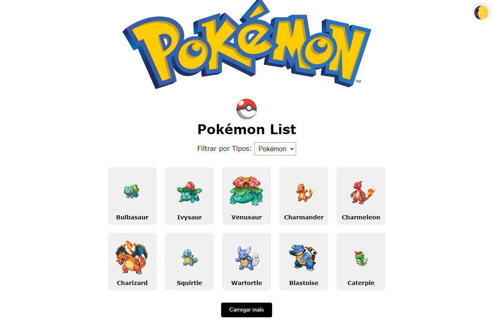
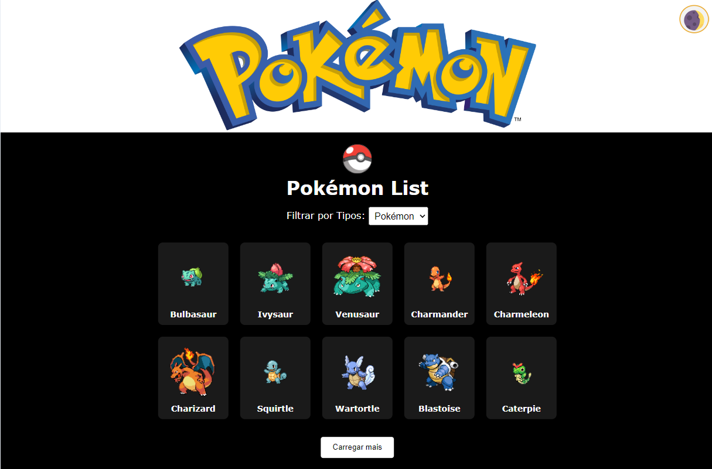
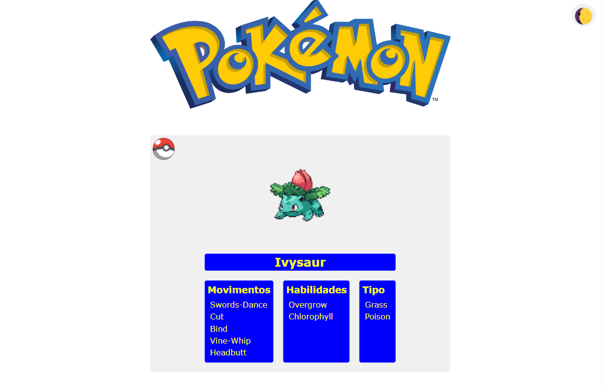
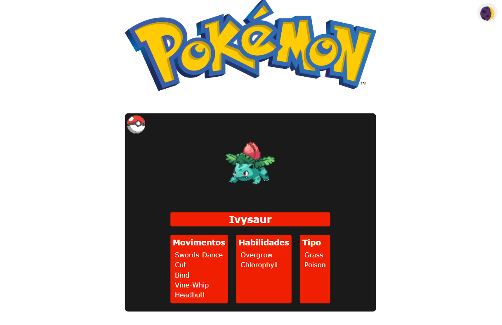
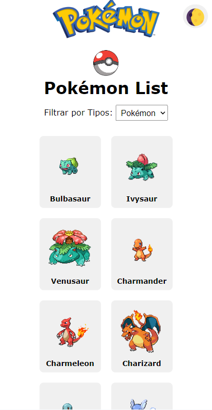
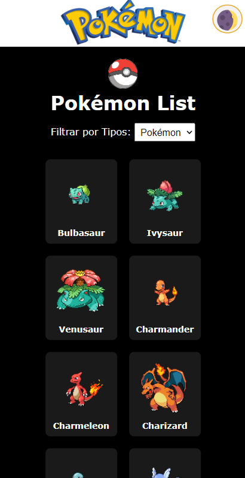

# Pokémon List Application

Esta aplicação exibe uma lista de Pokémons e permite ao usuário visualizar detalhes sobre cada um deles. Além disso, há um alternador de tema entre claro e escuro e um filtro para selecionar Pokémons por tipo.

  
  

  
  

  
  

## Funcionalidades
- Listagem de Pokémons com carregamento incremental (10 por vez).
- Visualização de detalhes de cada Pokémon, incluindo seus movimentos, habilidades e tipo.
- Alternador de tema claro/escuro.
- Filtro por tipo de Pokémon.
- Testes unitários implementados com Jest e React Testing Library.

## Ferramentas Utilizadas
- **React.js**: Para construir a interface do usuário.
- **Axios**: Para realiza requisições HTTP
- **styled-components**: Para estilização dinâmica com suporte ao tema.
- **Context API**: Para gerenciar o estado global do tema (claro/escuro).
- **React Router DOM**: Para navegação entre páginas.
- **Jest e React Testing Library**: Para implementação de testes unitários.

## Como Rodar o Projeto
1. Clone este repositório.
2. No terminal, execute `npm install` para instalar as dependências.
3. Execute `npm run dev` para iniciar a aplicação.
4. Para rodar os testes, execute `npm test`.